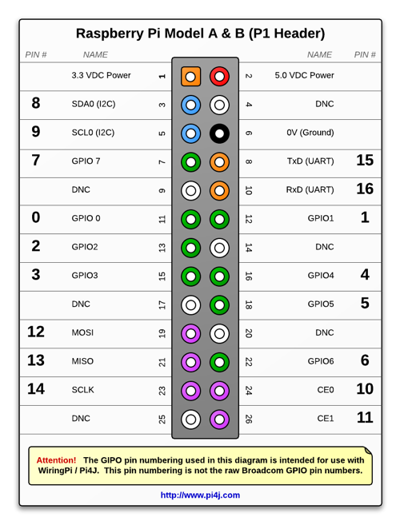

# 3d-scanner
This project contains software and 3d files for a 3d Scanner developed for the Virtual Reality Course at Hochschule Heilbronn in SoSE 2024.
## 3D Modells
## Used Hardware
- Raspberry Pi Model B (Revision 2.0)
### Pins
- motor one: pins [8, 9, 7, 0]
- motor two: pins [2, 3, 12, 13]
- motor three: pins [15, 16, 1, 4]
  

[link doku](https://www.pi4j.com/1.2/pins/model-b-rev2.html)

### Driver
The gobot driver for stepper motors was used to controll the scanner 2 axis.

## Software
### Development
[Install Go and TinyGo](https://tinygo.org/getting-started/install/)
## Result
